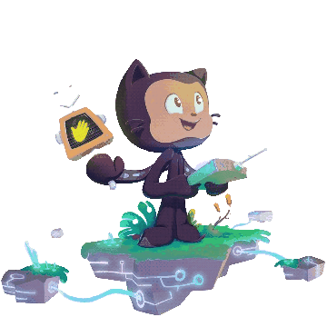

  <a href=https://github.com/user-attachments/assets/eef64bb7-c697-4c2a-ad70-db21fb1f43d3>
    

#

Estudante de Análise e Desenvolvimento de Sistemas na Unisinos de Porto Alegre.
Me considero uma eterna aprendiz, estou sempre buscando aprender mais e atualizar meus conhecimentos buscando novos desafios. 
  

<h3 align="left">Connect with me!</h3>

<h3 align="left">𖤐 My Stack</h3>

  
  
  
          
  
  
         

#

  <h3>* GitHub Stats *</h3>
   
  

  

#          

<picture align="center">
  <source media="(prefers-color-scheme: dark)" srcset="https://raw.githubusercontent.com/namartinxs/namartinxs/output/github-contribution-grid-snake-dark.svg">
  <source media="(prefers-color-scheme: light)" srcset="https://raw.githubusercontent.com/namartinxs/namartinxs/output/github-contribution-grid-snake-dark.svg">
  
</picture>

          

           
          
